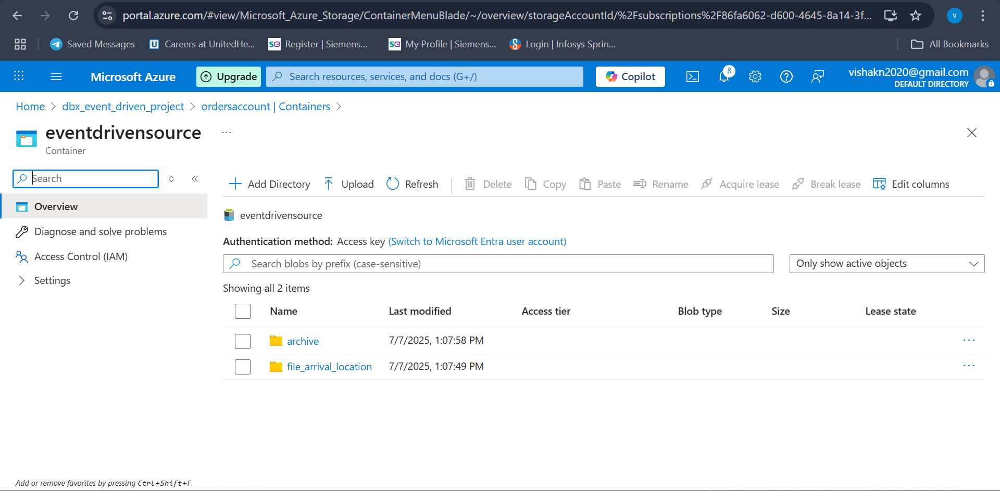
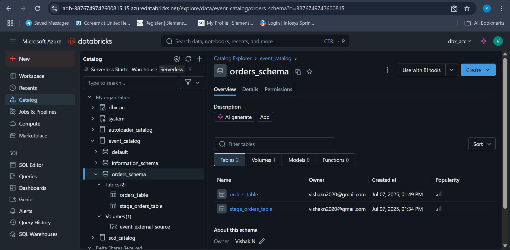
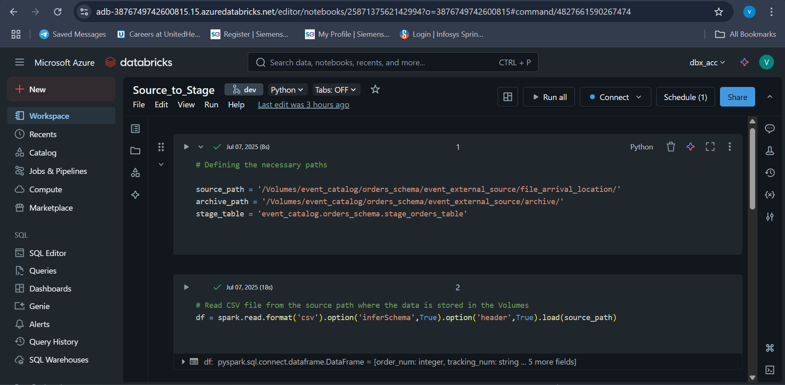
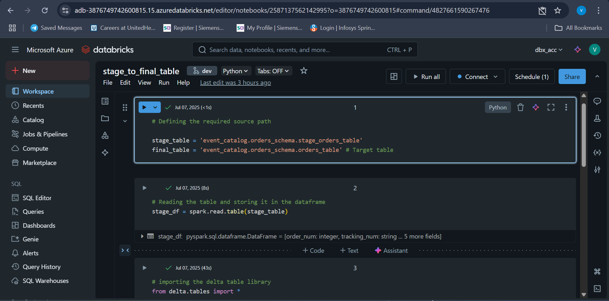
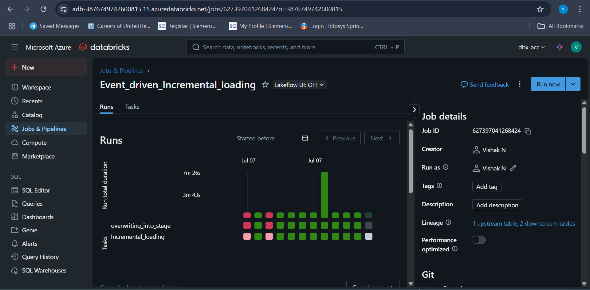
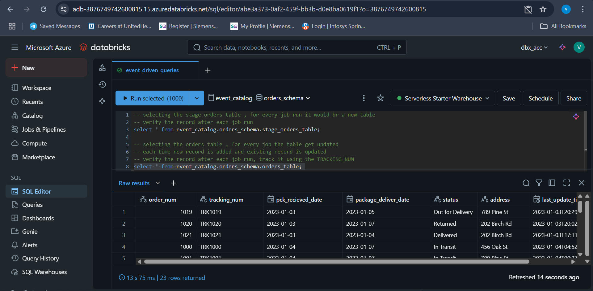

# 🛒 Order Tracking Pipeline using Databricks

This project developed uaing the **Databricks** used to track the orders, to know about the current status of the orders in daily basis.

Client / Source will be uploading the Daily order status in a source location, then it will be moved to staging layer (overwritten everytime) and then loaded incrementally to the final table.

📤 Client → 📁 Source → 🗂️ Staging (overwrite) → 🔁 Incremental Load → 📊 Final Table → 📤 sql queries

---

## 🛠️ Tech Stack

- Azure Databricks
- Azure Data Lake
- Git for version control

---

## 🚀 Getting Started
Steps to get started with the project

### Step 1: 📁 Create Azure Account and required Containers in Azure Data Lake
Create the storage account with namespace heirarchy checkbox ticked to create the Azure Data lake or Azure blob stoarge can also be used, In the ADLS create the containers such as

eventsource - container to store the data
- archive (where the raw daily orders file will be stored for future use)
- file_arrival_location (where the daiy source file will be uploaded)

### Step 2: 🔗 Create Azure Databricks Account and it's Integration with the Azure Data Lake
- Connect the Azure Databricks with the Azure either using Service Principal or Azure Managed Identity as crenditial.
- Allow the access for the specific container so that the Databricks have the permission to access it.

### Step 3: 📁 Create Managed Catalog, Managed Schema and External Volume
- In the Databricks,create the catalog and the schema with in the catalog
- after that create the external volume using the managed identity and allow the databricks to access specific container by adding the member in the IAM.

**Note:** Create the compute Engine to run the Notebooks
 
### Step 4: 🛠 Create Notebooks 
- create the NoteBook Source_to_Stage   
  which extract the data from the file_arrival folder and overwrite it to the `stage_orders_table` and files in the file_arrival location will be moved to the archive folder.
- create the Notebook Stage_to_Final
  which gets the data from the `stage_orders_table` to `orders_table`, it will incrementally load the data,
  based on the **merge_condition = "stage.tracking_num = target.tracking_num"** it will delete the appropriate record and add the new one and update the old record.

**Note:** Tables will be created automatically while running the job.

 ### Step 5: 🛠 Create Job
- creating a job pipeline in the workflows, each notebook will be created as a task and therefore creating a job pipeline, then job will be scheduled as file arrival (act as a event driven pipeline)

- **Note:** Manually run it or schedule it to start the job.

### Step 6: 🔍 Verify and Track Data:
- use SQL queries to track the orders using tracking_num.
- **Select * from event_catalo.orders_schema.orders_table**

  
---

### 📦 Usage

Once the Job triggered

1. **Source**: raw order records are read from the file_arrival location
2. **Stage**:  raw order records are inserted into `stage_orders_table`.
3. **Process**: Records are merged or inserted into `orders_table`.
4. **Validation**: Queries are used to check updates and track records.

📤 Client → 📁 Source → 🗂️ Staging (overwrite) → 🔁 Incremental Load → 📊 Final Table → 📤 sql queries

---

